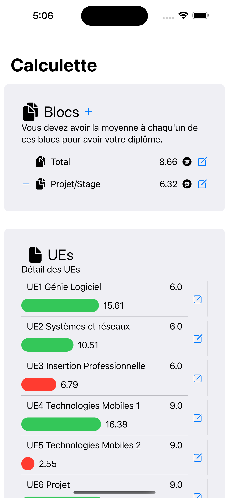
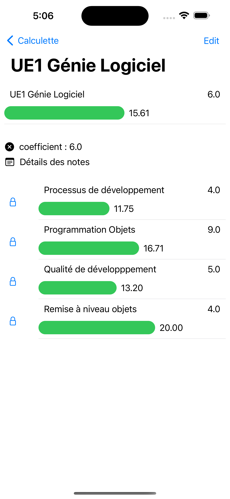
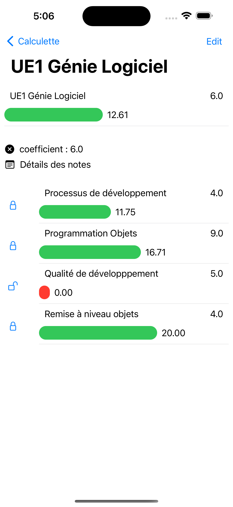
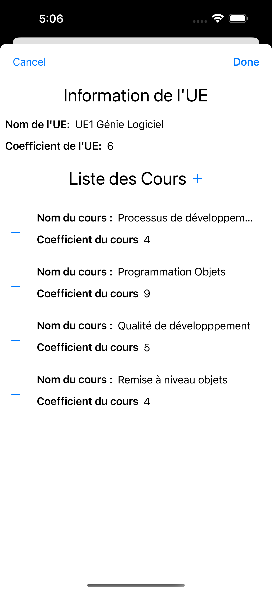
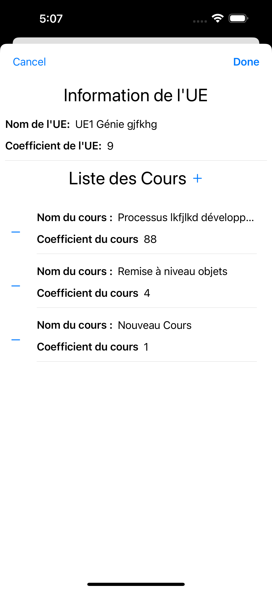
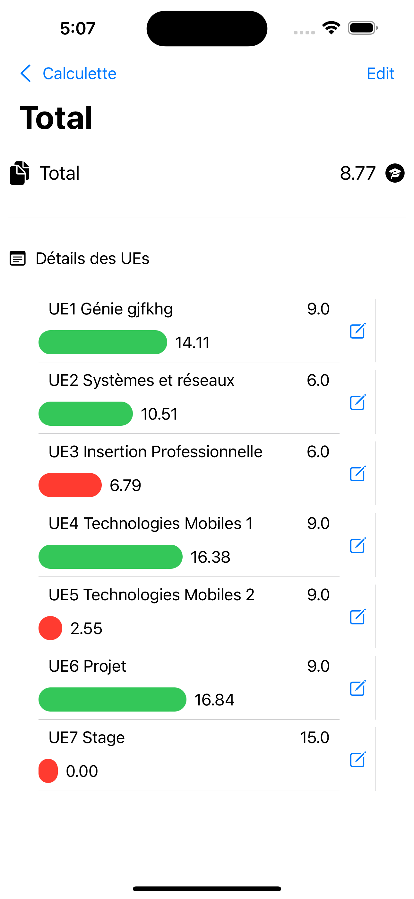
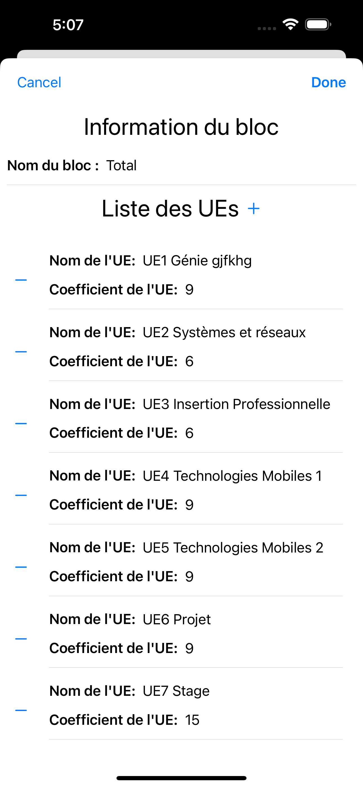
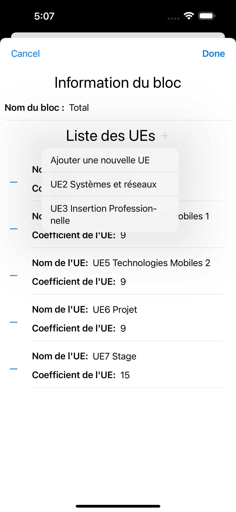
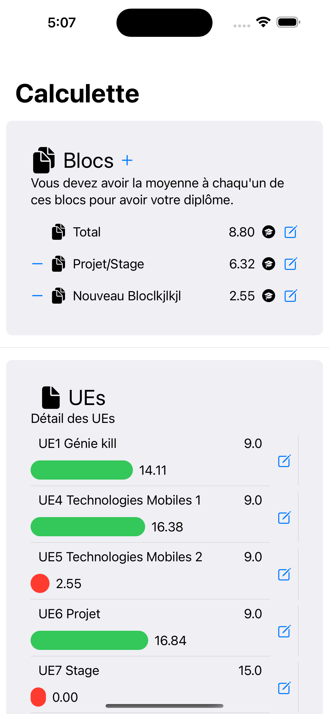

# ios-average-calc

## Overview

Little ios app for calc your average. I use Swift UI with a custom MVVM architecture.
I use an updated version of the [F&F](https://codefirst.iut.uca.fr/documentation/mchSamples_Apple/docusaurus/iOS_MVVM_guide/docs/viewModels/changeNotifications/ffSolution/)with the adding of a base view model class.

## Screenshots




</br>



</br>




## Features
- [x] See list of UEs
- [x] See details of UE
- [x] See list of courses
- [x] Edit mark of courses with a (Slider, thanks to Yohann :))
- [x] Edit an UE
  - [x] Change name
  - [x] Change coefficient
  - [x] Edit courses (Name and coefficient)
  - [x] Add/Delete courses
- [x] See list of blocks
- [x] See details of block
- [x] See list of UEs in block
- [x] Edit an block
  - [x] Change name
  - [x] Edit UEs (Name and coefficient)
  - [x] Add/Delete UEs
- [x] Add/Delete blocks
- [x] Data persistence
- [ ] Change data (switch between people)

## Getting Started

### Prerequisites

- Xcode
- iOS Simulator or iOS Device with iOS 13.0 or above

### Installation

1. Clone the repo
   ```sh
   git clone
    ```
2. Open the project with Xcode
3. Run the project with the simulator or your device

## Authors

[](https://github.com/iShoFen)
[](https://www.linkedin.com/in/samuel-sirven-b49b53211/)
